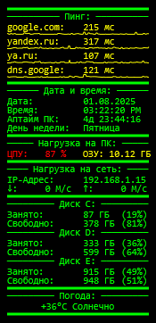

# Rainmeter скин «CPInfo»
Кастомный конфиг Rainmeter для мониторинга системы:
- Пинг, дата, время, аптайм, день недели, нагрузка на ЦПУ, ОЗУ, локальный IP-адрес, трафик, свободное пространство на дисках и погода
- Цветовая логика, кастомные кнопки, линии
- Лёгкий, не нагружает систему

## Установка:
1. Скопировать папку `PCInfo` в `Documents\Rainmeter\Skins`
2. Перезапустить Rainmeter
3. Активировать скин через диспетчер скинов
Или просто установить `PCInfo.rmskin`

## Скриншот^

